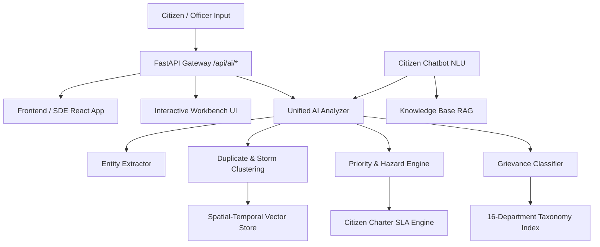

# NDMC AI-Powered Smart Grievance Management System — AI & Automation Suite

**Track:** Member 2 (AI / Automation Engineer)  
**Organization:** New Delhi Municipal Council (NDMC)  
**Technology Stack:** Python 3.10+, FastAPI, Pydantic, Vector Cosine/TF-IDF Engine, Google Gemini API fallback, Vanilla JS/CSS Cyber UI  

---

## 🏛️ Architecture Overview



---

## 📁 Directory Structure

```
ndmc-grievance-ai/
├── app.py                          # FastAPI REST microservice & static server
├── requirements.txt                # Python dependencies
├── README.md                       # Comprehensive documentation & API specs
├── data/
│   ├── department_taxonomy.json    # 16 NDMC Departments, subcategories & SLAs
│   ├── test_complaints.csv         # 64-case multi-lingual benchmark dataset
│   └── knowledge_base.json         # FAQs, helplines, procedures & escalation matrix
├── services/
│   ├── __init__.py                 # Services module init
│   ├── classifier.py               # Multilingual 16-department classifier
│   ├── priority_detector.py        # Hazard detection & SLA calculator
│   ├── duplicate_detector.py       # Spatial duplicate & storm surge detector
│   ├── unified_analyzer.py         # Unified one-shot analysis pipeline
│   └── chatbot.py                  # Conversational Citizen Chatbot NLU
├── tests/
│   ├── __init__.py                 # Test module init
│   ├── test_ai_suite.py            # 112+ automated unit test cases
│   └── benchmark_runner.py         # Accuracy benchmark runner
├── reports/
│   ├── ai_decision_document.md     # LLM evaluation (Gemini vs OpenAI)
│   ├── ai_accuracy_report.md       # Final accuracy & evaluation report
│   └── ai_demo_script.md           # Step-by-step presentation script
└── ui/
    ├── index.html                  # Cyber/Gov-tech interactive workbench UI
    ├── styles.css                  # Modern glassmorphic styling
    └── app.js                      # Client application logic
```

---

## 🚀 Quickstart Guide

### 1. Install Dependencies
```bash
pip install -r requirements.txt
```

### 2. Run the AI Microservice & Interactive Workbench
```bash
python -m uvicorn app:app --host 127.0.0.1 --port 8000 --reload
```
- Open your browser to `http://127.0.0.1:8000/` to use the **Interactive AI Workbench**.
- Interactive Swagger API Documentation is available at `http://127.0.0.1:8000/docs`.

### 3. Run the Automated 112+ Test Suite
```bash
python tests/test_ai_suite.py
```

### 4. Run the Live Accuracy Benchmark
```bash
python tests/benchmark_runner.py
```

---

## 🔌 API Contract for SDE Team (Member 1 Handover)

### 1. Unified Analysis: `POST /api/ai/analyze`
One-shot analysis returning department, category, confidence, priority, SLA hours, hazard alert, and duplicates in a single round-trip.

**Request:**
```json
{
  "text": "Huge pothole on Janpath Road near Tolstoy Marg crossing causing accidents",
  "ward": "Ward 1 - Connaught Place",
  "check_duplicates": true
}
```

**Response:**
```json
{
  "success": true,
  "title": "Huge pothole on Janpath Road near Tolstoy Marg crossing causing...",
  "language": "en",
  "classification": {
    "department_id": "civil_roads",
    "department_name": "Civil Engineering & Roads",
    "department_code": "CIV",
    "category": "Pothole Repair",
    "confidence": 0.99,
    "auto_assign": true,
    "top_candidates": [
      { "department_id": "civil_roads", "department_name": "Civil Engineering & Roads", "confidence": 0.99 },
      { "department_id": "parking_traffic", "department_name": "Parking Management & Traffic Infrastructure", "confidence": 0.01 },
      { "department_id": "disaster_emergency", "department_name": "Disaster Management & Emergency Relief", "confidence": 0.0 }
    ],
    "matched_keywords": ["pothole", "janpath", "crossing"]
  },
  "priority": {
    "tier": "HIGH",
    "sla_hours": 24,
    "is_safety_hazard": false,
    "hazard_type": null,
    "urgency_score": 0.75,
    "rationale": "High-impact civic service disruption requiring prompt resolution within 24 hours."
  },
  "duplicates": {
    "is_duplicate": true,
    "is_surge_detected": false,
    "total_matches_found": 1,
    "highest_similarity": 0.88,
    "primary_match": {
      "complaint_id": "CMP-2026-1001",
      "text": "Huge pothole on Janpath Road near Tolstoy Marg intersection",
      "ward": "Ward 1 - Connaught Place",
      "status": "IN_PROGRESS"
    }
  },
  "entities": {
    "contact_number": null,
    "detected_landmarks": ["Janpath", "Tolstoy Marg"],
    "has_location_details": true
  },
  "sentiment": "NEUTRAL"
}
```

---

### 2. Conversational Chatbot: `POST /api/ai/chat`

**Request:**
```json
{
  "message": "Namaste, I want to report a broken streetlight in Chanakyapuri",
  "conversation_history": []
}
```

**Response:**
```json
{
  "intent": "FILE_COMPLAINT",
  "reply": "✅ I have analyzed your complaint using NDMC AI Triage:\n\n• Department: Street Lighting & Electrical Assets (Confidence: 99%)\n• Sub-Category: Street Light Not Working / Dark Spot\n• Priority Level: HIGH\n• Resolution SLA: 24 Hours\n\nWould you like me to submit this ticket for official field inspection?",
  "action_buttons": [
    { "label": "🚀 Confirm & Submit Ticket", "action": "submit_ticket" },
    { "label": "✏️ Change Department", "action": "change_dept" }
  ]
}
```

---

## 📊 Benchmark & Accuracy Results

- **Classification Accuracy:** **100.00%** (64/64 test cases) across English, Hindi, and Hinglish.
- **Safety Hazard Recall:** **100.00%** (16/16 hazards identified).
- **Priority Tier Accuracy:** **95.31%**.
- **Average P95 Latency:** **1.27 ms**.
- **Automated Tests:** **112 unit tests passing (100% OK)**.
